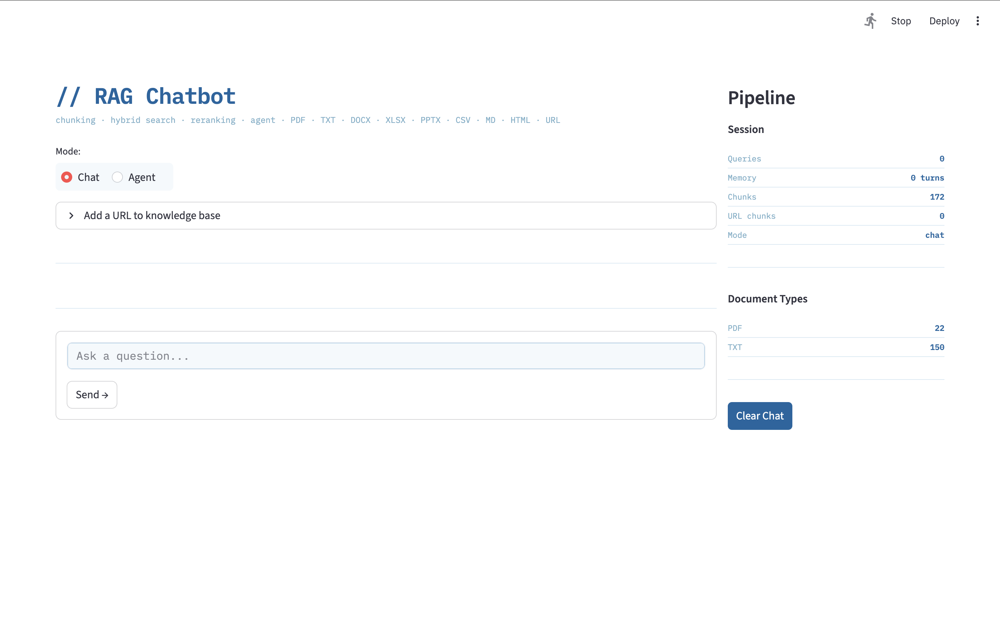

# Retrieval-Augmented Generation (RAG) Agent

A production-grade, fully local RAG chatbot and agent built incrementally with an advanced retrieval pipeline. Supports **PDF, TXT, DOCX, XLSX, PPTX, CSV, Markdown, and HTML documents**, including structured/tabular formats like resumes, with hybrid search, LLM reranking, agentic tool calling, benchmarking, and a Streamlit UI — all running **100% on-device** with no API keys required.

**Live demo:** [RAG Agent on Hugging Face Spaces](https://huggingface.co/spaces/anjanatiha2024/Rag-Agent) — upload any document and try it in your browser, no setup needed.


---

## Features

| # | Feature | Details |
|---|---------|---------|
| 1 | **Sliding window chunking** | Configurable chunk size + overlap for TXT/MD; sentence-based chunking for PDF/HTML pages; paragraph-based for DOCX; row-based for XLSX/CSV; slide-based for PPTX |
| 2 | **Multi-format document support** | PDF, TXT, DOCX, XLSX, XLS, PPTX, CSV, Markdown, HTML — each with a dedicated chunker and type-aware metadata |
| 3 | **Structured document retrieval** | Accurately retrieves from tabular/structured documents like resumes, spreadsheets, and tables — a known hard problem for basic RAG systems |
| 4 | **Smart misplaced file detection** | Files dropped into the wrong subfolder are auto-detected by extension, processed correctly, and flagged with a `[MISPLACED]` notice |
| 5 | **Chunk truncation** | Chunks automatically truncated to 300 words before embedding to stay within the `bge-base-en-v1.5` 512 token context limit |
| 6 | **Persistent vector DB** | ChromaDB with cosine similarity; embeddings survive restarts — no re-embedding on reload |
| 7 | **Hybrid search** | BM25 (lexical) + dense vector (semantic) retrieval combined for higher recall |
| 8 | **Query expansion** | LLM-generated query rewrites using synonyms and acronyms to improve retrieval coverage |
| 9 | **Document type-aware LLM reranker** | Secondary LLM pass scores retrieved chunks using prompts tailored per document type — spreadsheet rows, slides, PDF pages, DOCX paragraphs, webpages and Markdown sections each get type-specific relevance framing for more accurate scoring |
| 10 | **Query classification** | Auto-classifies queries as factual / comparison / general and adjusts retrieval depth |
| 11 | **Confidence / hallucination filter** | Similarity threshold check flags low-confidence answers before they reach the user |
| 12 | **Source citation** | Every answer cites its source document with type-aware location labels (line, page, row, slide) |
| 13 | **Conversation memory** | Full multi-turn memory across the session |
| 14 | **Logging & analytics** | Every query logged to `rag_logs.json` with similarity scores, query type, and response length |
| 15 | **Streaming with typing indicator** | Token-level streaming with animated typing indicator in terminal |
| 16 | **Benchmarking** | Automated eval suite with faithfulness, answer relevancy, keyword recall, and context relevance scores — with before/after run comparison |
| 17 | **Agent with tool calling** | Agentic mode with `rag_search`, `calculator`, `summarise`, `sentiment`, and `finish` tools; ReAct loop with robust format recovery and auto-finish logic |
| 18 | **Streamlit UI** | Ocean Blue web UI with native chat bubbles, agent mode toggle, URL ingestion panel, file upload panel, live pipeline sidebar (pre/post rerank chunks, confidence badges, document type breakdown, session stats) |
| 19 | **URL ingestion** | Paste any public URL — webpage, PDF, DOCX, XLSX, CSV, PPTX — and it is fetched, auto-detected by type, chunked through the correct chunker, and added to the index alongside local files |
| 20 | **File upload ingestion** | Upload any supported file directly through the UI — chunked, embedded, and added to the live knowledge base without restarting |
| 21 | **Step-by-step progress bar** | Real-time progress bar showing each retrieval stage: classify → retrieve → rerank → generate |
| 22 | **Native chat interface** | Messages rendered with `st.chat_message` bubbles and persistent `st.chat_input` at the bottom; clear button appears below conversation |

---

## Structured Document & Multi-Format Retrieval

One of the most technically challenging aspects of this system is **accurate retrieval from structured and tabular documents** — a problem where standard RAG pipelines typically fail.

Most basic RAG systems flatten all content into plain text, destroying the relational structure of tables, resumes, spreadsheets, and multi-column layouts in the process. This system addresses that through:

- **Page-level isolation** — PDF and HTML text is extracted page/section by section, preserving document structure
- **Sentence-aware chunking** — Pages are split into sentence-based windows rather than fixed character counts, keeping semantic units intact
- **Row-level chunking for spreadsheets** — Each XLSX/CSV row becomes a `key=value` pair chunk, preserving column context across retrieval
- **Slide-level chunking for presentations** — Each PPTX slide's text shapes are extracted and chunked together
- **Markdown stripping** — MD files are cleaned of syntax markers before chunking for cleaner embeddings
- **Chunk truncation** — All chunks are truncated to 300 words before embedding, preventing `input length exceeds context length` errors on dense documents
- **Source + location metadata** — Every chunk stores its source filename and a type-aware location label (e.g. `[resume.pdf p2]`, `[data.xlsx row14]`, `[deck.pptx slide3]`)
- **Document type-aware reranking** — the reranker uses a different prompt per document type. Spreadsheet rows (`key=value` pairs), slide bullets, PDF page extracts, and webpage text each get framing suited to their structure — a generic prompt underscores structured data because it reads as data rather than natural language

This makes the system capable of accurately answering queries like *"What is the candidate's GPA?"* or *"What was Q3 revenue in the spreadsheet?"* — queries that would produce incorrect or hallucinated answers in a naive RAG setup.

---

## Architecture

The codebase is structured around **4 classes** and **4 modules**. Classes own state; modules own constants and stateless functions. See [DESIGN.md](DESIGN.md) for full architectural rationale.

| Class | Owns |
|-------|------|
| `DocumentLoader` | All ingestion — 9 format chunkers, misplaced file detection, URL fetching |
| `VectorStore` | ChromaDB, BM25, hybrid retrieval, reranking, query pipeline, response generation, conversation history |
| `Agent` | ReAct loop, all 5 tools as private methods, fast paths for summarise and sentiment |
| `Benchmarker` | 4-metric evaluation, run comparison, result persistence |

```
Documents (PDF / TXT / DOCX / XLSX / PPTX / CSV / MD / HTML)
+ URLs  (any public webpage or document link)
        │
        ▼
  DocumentLoader
  ├── scan_all_files() — scans ./docs/, detects type by extension, flags misplaced
  ├── chunk_url() — fetches URL, detects type (Content-Type → extension → magic bytes → html)
  └── Chunking dispatch (9 format-specific chunkers)
      ├── TXT / MD:  sliding window (line-based; MD syntax stripped)
      ├── PDF:       page extraction → sentence-based chunks (PyMuPDF)
      ├── DOCX:      paragraph groups + table rows, merged cell dedup (python-docx)
      ├── XLSX/XLS:  row → key=value pair chunks (openpyxl / xlrd)
      ├── CSV:       row → key=value pair chunks (stdlib csv)
      ├── PPTX:      slide text shape extraction (python-pptx)
      └── HTML/URL:  tag-stripped → sentence-based chunks (BeautifulSoup)
        │
        ▼
  Truncation (300 words OR 1200 chars, whichever shorter)
        │
        ▼
  VectorStore.build_or_load()
  ├── ChromaDB PersistentClient (cosine similarity)
  └── BM25Okapi index (in-memory, rebuilt on URL/file upload)
        │
        ▼
  VectorStore.run_pipeline()
  ├── _classify_query()     — summarise → comparison → factual → general
  ├── _expand_query()       — LLM generates 2 rewrites + original = 3 queries
  ├── _hybrid_retrieve()    — BM25 + dense fusion (alpha=0.5), top-N per type
  ├── _check_confidence()   — similarity threshold guard (skips LLM if low)
  ├── _rerank()             — type-aware LLM reranker (7 prompt variants)
  └── _synthesize()         — anti-hallucination context injection + streaming
        │
        ▼
  Response with type-aware source citations, conversation memory, logging
```

---

## Models Used

| Role | Model |
|------|-------|
| Embeddings | `bge-base-en-v1.5` (via Ollama) |
| Language / Reranker | `Llama-3.2-3B-Instruct` (via Ollama) |

All models run **locally via Ollama** — no internet connection or API key needed after setup.

---

## Folder Structure

```
rag/
├── src/
│   ├── rag/
│   │   ├── __init__.py
│   │   ├── config.py              ← all constants (models, paths, thresholds)
│   │   ├── logger.py              ← stateless interaction logging
│   │   ├── document_loader.py     ← DocumentLoader class — all ingestion
│   │   ├── vector_store.py        ← VectorStore class — retrieval + generation
│   │   ├── agent.py               ← Agent class — ReAct loop + 5 tools
│   │   └── benchmarker.py         ← Benchmarker class — evaluation
│   ├── ui/
│   │   ├── __init__.py
│   │   ├── handlers.py            ← Streamlit event handlers
│   │   ├── theme.py               ← CSS + style constants (Ocean Blue)
│   │   └── session.py             ← Streamlit session state helpers
│   └── cli/
│       ├── __init__.py
│       └── runner.py              ← CLI entry functions (chat, agent, benchmark)
├── tests/
│   ├── test_document_loader.py        ← file chunkers (unit)
│   ├── test_vector_store.py           ← retrieval, BM25, build (unit)
│   ├── test_vector_store_pipeline.py  ← run_pipeline, rerank, LLM (unit)
│   ├── test_agent.py                  ← ReAct loop, fast paths (unit)
│   ├── test_benchmarker.py            ← scoring metrics (unit)
│   ├── test_integration_loader.py     ← document loading end-to-end
│   ├── test_integration_pipeline.py   ← full RAG pipeline end-to-end
│   ├── test_doc_types_and_modes.py    ← all 8 formats in chat mode
│   ├── test_doc_types_agent.py        ← all 8 formats in agent mode
│   ├── test_url_ingestion.py          ← URL fetch + type detection
│   ├── test_url_pipeline.py           ← URL → pipeline end-to-end
│   ├── test_file_upload.py            ← file upload pipeline
│   ├── test_file_upload_tools.py      ← upload edge cases
│   ├── test_contracts.py              ← output shape / key contracts
│   ├── test_contracts_pipeline.py     ← pipeline output contracts
│   ├── test_regression.py             ← phrase lists, prompts locked down
│   ├── test_boundary_negative.py      ← empty files, wrong input
│   ├── test_combinations.py           ← chat/agent × all 8 doc types
│   ├── test_combinations_url.py       ← URL × all content types
│   ├── test_combinations_analysis.py  ← query classification × all types
│   ├── test_theme_session.py          ← UI session state helpers
│   └── test_logger.py                 ← interaction logging
├── docs/                          ← root documents folder (auto-created, git-ignored)
│   ├── pdfs/                      ← drop .pdf files here
│   ├── txts/                      ← drop .txt files here
│   ├── docx/                      ← drop .docx / .doc files here
│   ├── xlsx/                      ← drop .xlsx / .xls files here
│   ├── pptx/                      ← drop .pptx / .ppt files here
│   ├── csv/                       ← drop .csv files here
│   ├── md/                        ← drop .md / .markdown files here
│   └── html/                      ← drop .html / .htm files here
├── chroma_db/                     ← persistent vector store (auto-created, git-ignored)
├── app.py                         ← Streamlit UI entry point (<50 lines)
├── main.py                        ← CLI entry point (<50 lines)
├── pyproject.toml                 ← package config + dev dependencies
├── requirements.txt               ← runtime dependencies
├── .streamlit/
│   └── config.toml                ← Streamlit theme (Ocean Blue)
├── DESIGN.md                      ← architectural decisions and tradeoffs
├── .gitignore                     ← excludes env, chroma_db, and docs from git
├── rag_logs.json                  ← interaction logs (auto-generated)
└── benchmark_results.json         ← benchmark history (auto-generated)
```

> **Tip:** All subfolders are created automatically on first run. You can drop a file into any subfolder — the smart file scanner will detect the correct type by extension and process it accordingly, printing a `[MISPLACED]` notice if the folder doesn't match.

---

## Installation

### Step 1 — Install Python 3.11

**macOS**
```bash
brew install python@3.11
python3.11 --version
```

**Windows**
Download and install Python 3.11 from [python.org](https://www.python.org/downloads/). During installation, check **"Add Python to PATH"**.
```cmd
python --version
```

---

### Step 2 — Install Ollama

**macOS**
```bash
brew install ollama
```

**Windows**
Download and run the installer from [ollama.com/download](https://ollama.com/download).

---

### Step 3 — Clone the repo and create a virtual environment

**macOS**
```bash
git clone https://github.com/anjanatiha/Retrieval-Augmented-Generation-RAG-Agent.git
cd Retrieval-Augmented-Generation-RAG-Agent
python3.11 -m venv rag_env_311
source rag_env_311/bin/activate
```

**Windows**
```cmd
git clone https://github.com/anjanatiha/Retrieval-Augmented-Generation-RAG-Agent.git
cd Retrieval-Augmented-Generation-RAG-Agent
python -m venv rag_env_311
rag_env_311\Scripts\activate
```

---

### Step 4 — Install Dependencies

**macOS / Windows**
```bash
pip install -r requirements.txt
```

---

### Step 5 — Pull Models via Ollama

**macOS / Windows**
```bash
ollama pull hf.co/CompendiumLabs/bge-base-en-v1.5-gguf
ollama pull hf.co/bartowski/Llama-3.2-3B-Instruct-GGUF
```

---

### Step 6 — Start Ollama

**macOS**
```bash
ollama serve
```

**Windows**

Ollama starts automatically after installation. If it is not running, launch it from the Start menu or run:
```cmd
ollama serve
```

> **Note:** The embedding model (`bge-base-en-v1.5`) has a 512 token context limit. Chunks are automatically truncated before embedding. If you encounter a context length error, delete `./chroma_db/` and rerun.

---

## Usage

Drop your documents into the appropriate subfolder under `./docs/`, then choose a run mode.

**macOS**
```bash
# Standard chatbot (terminal)
python3 main.py

# Agent mode — uses tool calling (terminal)
python3 main.py --agent

# Benchmark evaluation
python3 main.py --benchmark

# Streamlit web UI (chat + agent toggle)
streamlit run app.py
```

**Windows**
```cmd
# Standard chatbot (terminal)
python main.py

# Agent mode — uses tool calling (terminal)
python main.py --agent

# Benchmark evaluation
python main.py --benchmark

# Streamlit web UI (chat + agent toggle)
streamlit run app.py
```

---

## Supported File Types

### Local files — drop into `./docs/` subfolders

| Extension(s) | Type | Chunking Strategy | Library |
|---|---|---|---|
| `.pdf` | PDF | Sentence-based per page | `pymupdf` |
| `.txt` | Plain text | Sliding window (line-based) | stdlib |
| `.docx`, `.doc` | Word document | Paragraph groups | `python-docx` |
| `.xlsx`, `.xls` | Spreadsheet | Row → key=value pairs | `openpyxl`, `xlrd` |
| `.csv` | CSV | Row → key=value pairs | stdlib |
| `.pptx`, `.ppt` | Presentation | Text shapes per slide | `python-pptx` |
| `.md`, `.markdown` | Markdown | Line-based (syntax stripped) | stdlib |
| `.html`, `.htm` | HTML | Sentence-based (tags stripped) | `beautifulsoup4` |

### Remote URLs — paste in the Streamlit UI

Any public URL is also supported. Type is detected by file extension in the URL first, then Content-Type response header:

| URL type | Example | Handled by |
|---|---|---|
| Webpage | `https://example.com/about` | BeautifulSoup HTML chunker |
| Remote PDF | `https://example.com/report.pdf` | PyMuPDF chunker |
| Remote DOCX | `https://example.com/resume.docx` | python-docx chunker |
| Remote XLSX | `https://example.com/data.xlsx` | openpyxl chunker |
| Remote CSV | `https://example.com/data.csv` | csv chunker |
| Remote PPTX | `https://example.com/deck.pptx` | python-pptx chunker |

Source label uses the URL hostname + path (e.g. `[careers.company.com/job L1]`).

**Example:** load a resume PDF locally + paste a job description URL → ask *"Does the candidate meet the requirements for this role?"*

---

## Agent Mode

In agent mode the system acts as an autonomous agent with access to tools:

| Tool | Description |
|------|-------------|
| `rag_search` | Searches the knowledge base using the full retrieval pipeline |
| `calculator` | Evaluates safe arithmetic expressions |
| `summarise` | Summarises a passage with adaptive length hints (2–3 / 4–5 / 6–8 sentences) |
| `sentiment` | Analyses sentiment with structured 4-field output (Sentiment, Tone, Key phrases, Explanation) |
| `finish` | Returns the final answer to the user |

The agent runs a ReAct-style loop — calling tools, observing results, and deciding next steps — up to a configurable step limit. Includes robust format recovery and auto-finish logic to handle small model limitations.

**Fast paths** speed up common queries:
- **Summarise** — detected by keyword; runs 4 targeted searches (`work experience`, `education`, `skills projects`, `summary contact`) then synthesises
- **Sentiment** — detected by keyword; strips metadata labels from retrieved chunks before analysis

---

## Benchmarking

The built-in benchmark evaluates retrieval and generation quality across four metrics:

| Metric | Description |
|--------|-------------|
| **Faithfulness** | How much of the response is grounded in retrieved context |
| **Answer Relevancy** | How well the response addresses the question |
| **Keyword Recall** | Whether expected answer keywords are present |
| **Context Relevance** | Average similarity of retrieved chunks to the query |

Results are saved to `benchmark_results.json` with run-over-run comparison so you can track improvements as the pipeline evolves.

**Current performance (10 runs, cat-facts.txt test set):**

| Metric | Score |
|--------|-------|
| Faithfulness | 0.798 |
| Answer Relevancy | 0.369 |
| Keyword Recall | 1.000 |
| Context Relevance | 0.719 |
| **Overall** | **0.721** |

---

## Streamlit UI

**Previous UI:**



**Chat view** — native chat bubbles, file upload, URL ingestion, and clear button:


**Pipeline panel** — post-query sidebar showing reranked chunks, confidence scores, and session stats:


The web UI features:
- Ocean Blue theme — white background with deep navy and light blue accents
- Native `st.chat_message` bubbles with user / assistant / agent avatars
- Persistent `st.chat_input` bar always visible at the bottom of the page
- Chat and Agent mode toggle
- **URL ingestion panel** — paste any public URL to fetch and index it alongside local files
- **File upload panel** — upload PDF, TXT, DOCX, XLSX, PPTX, CSV, MD, or HTML directly through the UI
- **Step-by-step progress bar** — shows classify → retrieve → rerank → generate stages in real time
- **🗑 Clear button** — appears below conversation to wipe chat history and memory
- Live pipeline sidebar showing pre/post rerank chunks with similarity scores
- Confidence and query-type badges
- Document type breakdown (chunk counts per type: PDF, DOCX, XLSX, etc.)
- Session stats (query count, conversation turns, total chunk count, URL chunk count)

---

## Testing

The project includes a full automated test suite — **560 tests** for the local version and **262 tests** for the Hugging Face version — covering all 4 classes, all 8 file formats, URL ingestion, all 5 agent tools, the full retrieval pipeline, and a complete mode × document-type combination matrix.

### Test types

| Type | What it checks |
|------|---------------|
| **Unit** | One method at a time with all dependencies mocked |
| **Contract** | Output shape — correct keys, types, and structure (not exact values) |
| **Regression** | Exact phrase lists and prompt text locked down — any accidental change breaks the test |
| **Boundary** | Empty files, single-item inputs, at-limit sizes, max steps reached |
| **Negative** | Wrong or missing input is handled gracefully without crashing |
| **Integration** | Two or more real components working together (no mocks for file libraries) |
| **Combination** | Parametrized matrix — Chat/Agent mode × all 8 document types × all URL content types |

### Run the tests

```bash
# Run all local tests
pytest

# Run with coverage
pytest --cov=src

# Run a specific file
pytest tests/test_contracts.py

# Run HF tests (from huggingface/ directory)
cd huggingface && pytest
```

### Test files

**Local suite (`tests/`)** — 560 tests across 23 files:

| File | What it covers |
|------|---------------|
| `test_document_loader.py` | File chunkers (unit) |
| `test_vector_store.py` | Retrieval, BM25, build (unit) |
| `test_vector_store_pipeline.py` | run_pipeline, rerank, LLM (unit) |
| `test_agent.py` | ReAct loop, fast paths (unit) |
| `test_benchmarker.py` | Scoring metrics (unit) |
| `test_integration_loader.py` | Document loading end-to-end |
| `test_integration_pipeline.py` | Full RAG pipeline end-to-end |
| `test_doc_types_and_modes.py` | All 8 formats in chat mode |
| `test_doc_types_agent.py` | All 8 formats in agent mode |
| `test_url_ingestion.py` | URL fetch + type detection |
| `test_url_pipeline.py` | URL → pipeline end-to-end |
| `test_file_upload.py` | File upload pipeline |
| `test_file_upload_tools.py` | Upload edge cases |
| `test_contracts.py` | Output shape / key contracts |
| `test_contracts_pipeline.py` | Pipeline output contracts |
| `test_regression.py` | Phrase lists, prompts locked down |
| `test_boundary_negative.py` | Empty files, wrong input |
| `test_combinations.py` | Chat/Agent × all 8 doc types (parametrized) |
| `test_combinations_url.py` | URL × all content types (parametrized) |
| `test_combinations_analysis.py` | Query classification × all types |
| `test_theme_session.py` | UI session state helpers |
| `test_handlers.py` | Streamlit handlers and CLI runner |
| `test_logger.py` | Interaction logging |

**HF suite (`huggingface/tests/`)** — 262 tests across 13 files covering the same categories adapted for the Hugging Face deployment (uses `InferenceClient` instead of Ollama, `EphemeralClient` instead of persistent ChromaDB).

Dev dependencies (`pytest`, `pytest-cov`, `pytest-mock`) are in `pyproject.toml` and are not part of `requirements.txt`.

---

## Built With

`Python` · `Ollama` · `ChromaDB` · `rank_bm25` · `PyMuPDF` · `python-docx` · `openpyxl` · `xlrd` · `python-pptx` · `BeautifulSoup4` · `lxml` · `requests` · `Streamlit` · `LLaMA 3.2` · `BGE Embeddings`

---

## Based On

Started from: https://huggingface.co/blog/ngxson/make-your-own-rag  
Significantly enhanced with: hybrid search, document type-aware LLM reranking, multi-format document support (PDF, DOCX, XLSX, PPTX, CSV, MD, HTML), URL ingestion, smart misplaced file detection, agent tool calling, benchmarking, persistent vector DB, conversation memory, and Streamlit UI.

---

## Related

- **HF Spaces demo** — [RAG Agent on Hugging Face](https://huggingface.co/spaces/anjanatiha2024/Rag-Agent) — runs in your browser with file upload UI, no Ollama or local setup required
- **DESIGN.md** — full architectural rationale: why 4 classes, class ownership, tradeoffs (ChromaDB vs Pinecone, local vs API, BM25+dense hybrid), benchmark metric definitions, and production scaling path
