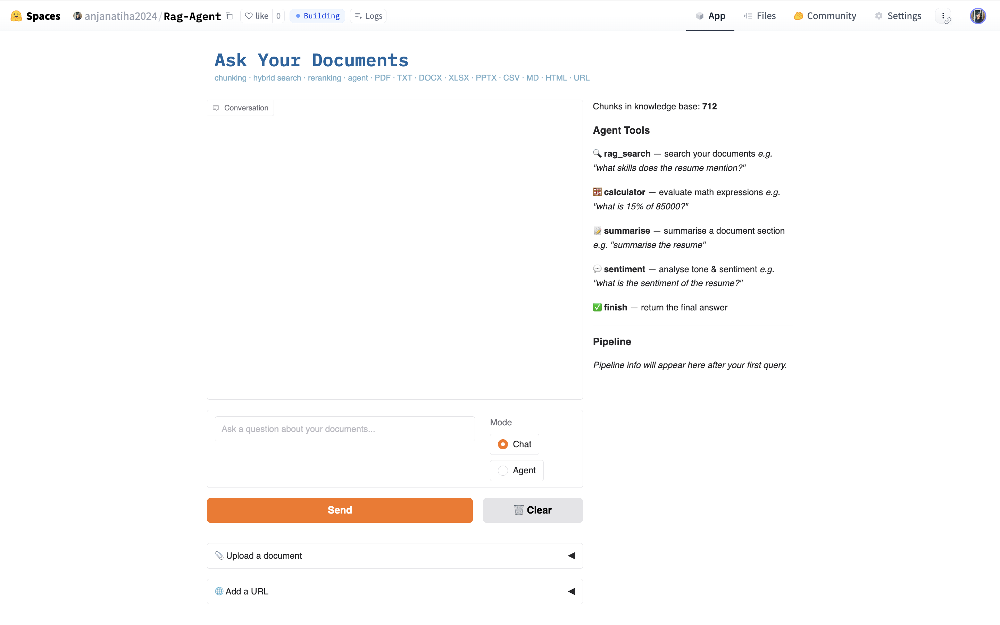
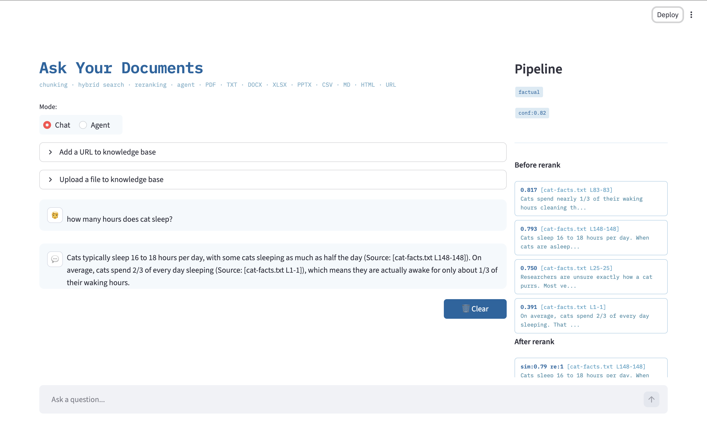
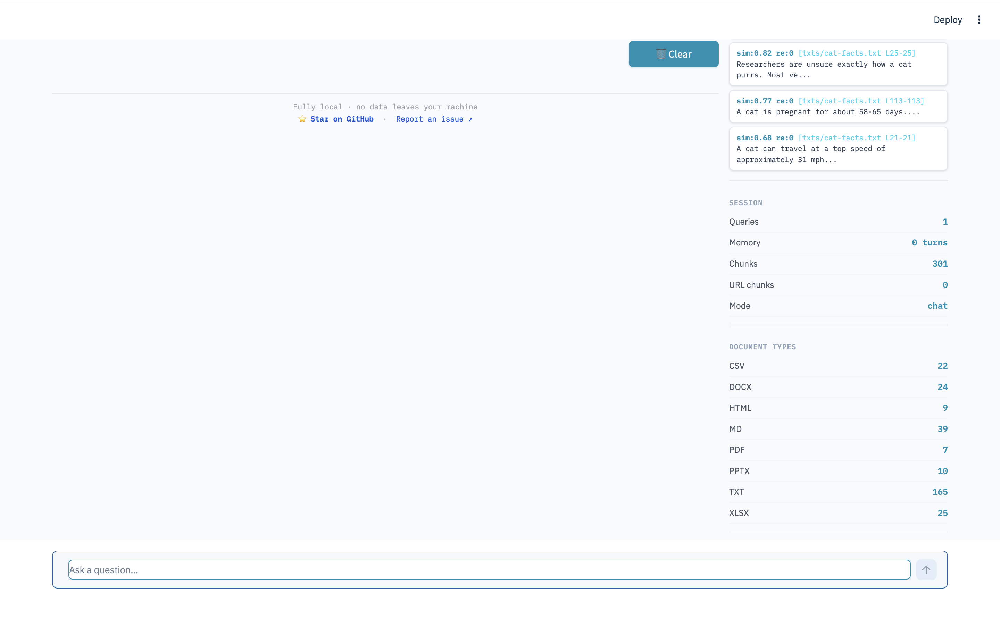

# RAG Agent — Retrieval-Augmented Generation System

Upload your documents. Ask questions in plain English. Get accurate answers with source citations — all running on your machine, no cloud, no API keys, no data leaving your device.

Supports PDF, Word, Excel, PowerPoint, CSV, Markdown, HTML, and plain text. Works with resumes, reports, spreadsheets, codebases, and any mixed folder of documents.

---

## Get Started

| | Option | Time |
|-|--------|------|
| **[► Try the live demo](https://huggingface.co/spaces/anjanatiha2024/Rag-Agent)** | Open in browser, upload a file, ask a question — nothing to install | 30 seconds |
| **[► Install locally](#installation)** | Run on your own machine, keep documents private | ~10 minutes |



**Already have Python 3.11 and Ollama?** Skip straight to the [Quick Start](#quick-start).

---

## Technical Highlights

Built from scratch as a production-grade NLP system — not a tutorial or notebook. Fully structured, tested, and deployed.

| Area | What was built |
|------|---------------|
| **NLP & Information Retrieval** | Hybrid BM25 + dense vector search, query expansion, query classification, type-aware LLM reranking, hallucination filtering |
| **LLM Application Engineering** | RAG pipeline design, ReAct agent loop with tool calling, prompt engineering across 7 document-type-specific reranker prompts, structured output parsing |
| **Software Architecture** | 4-class design with strict separation of concerns, stateless module functions vs stateful class methods, no circular dependencies, 500-line file cap |
| **Testing** | 828 tests across 36 files — unit, integration, contract, regression, boundary, negative, and parametrized combination tests |
| **Deployment** | Local Ollama deployment + Hugging Face Space using InferenceClient, persistent ChromaDB vector store, CI/CD pipeline |
| **Python Engineering** | Type hints throughout, Google-style docstrings, structured JSON logging, environment variable config, pinned dependency versions |
| **Data Engineering** | Format-specific chunkers for 9 document types — row-level extraction for XLSX/CSV, table extraction with merged cell deduplication for DOCX |

### Key design decisions

- **Hybrid search over pure dense retrieval** — BM25 + dense fusion achieves higher recall than either alone, especially for structured documents like spreadsheets where exact column names matter
- **Type-aware reranking** — 7 different LLM reranker prompts (one per document type) ensure a spreadsheet row is evaluated as structured data, not penalised for not being prose
- **4-class architecture** — all state-carrying logic lives in exactly 4 classes; stateless operations live in modules, preventing circular dependencies and keeping the codebase navigable
- **Confidence gate before every LLM call** — the system checks retrieval quality before calling the language model, skipping it entirely when no relevant content exists rather than hallucinating

### Benchmark results

| Metric | Score | What it measures |
|--------|-------|-----------------|
| Faithfulness | **0.798** | Response stays grounded in retrieved context |
| Keyword Recall | **1.000** | All expected facts appear in the answer |
| Context Relevance | **0.719** | Retrieval found the right chunks |
| Answer Relevancy | **0.369** | Response directly addresses the question |
| **Overall** | **0.721** | Mean across all four metrics |

### Deployments

| | URL | Stack |
|-|-----|-------|
| Hugging Face Space | [anjanatiha2024/Rag-Agent](https://huggingface.co/spaces/anjanatiha2024/Rag-Agent) | Gradio + InferenceClient |
| Local web UI | `streamlit run app.py` | Streamlit + Ollama |
| Local terminal | `python main.py` | argparse + Ollama |

---

## Table of Contents

**Using the system**
- [Get Started](#get-started) — browser demo or local install, choose your path
- [Quick Start](#quick-start) — already have Python & Ollama? 4 commands
- [Installation — full guide](#installation) — macOS & Windows, step by step from scratch
- [How to Use](#how-to-use)
- [Supported File Types](#supported-file-types)
- [Agent Mode](#agent-mode)
- [Troubleshooting](#troubleshooting)
- [Streamlit UI](#streamlit-ui)
- [What it does](#what-it-does)
- [Features](#features)

**How it works**
- [How RAG Works](#how-rag-works)
- [Architecture](#architecture)
- [Algorithms](#how-it-works--algorithms)
  - [Full Pipeline Diagram](#full-pipeline--how-all-algorithms-connect)
  - [1. Document Chunking](#1-document-chunking)
  - [2. Embedding](#2-embedding--turning-text-into-numbers)
  - [3. Query Expansion](#3-query-expansion--searching-with-multiple-phrasings)
  - [4. Query Classification](#4-query-classification--adjusting-retrieval-depth)
  - [5. Hybrid Search](#5-hybrid-search--combining-keyword-and-semantic-retrieval)
  - [6. Type-Aware LLM Reranking](#6-type-aware-llm-reranking--rescoring-by-document-type)
  - [7. Confidence Check](#7-confidence-check--deciding-whether-to-answer)
  - [8. Hallucination Filter](#8-hallucination-filter--catching-mid-response-fabrication)
  - [9. ReAct Agent Loop](#9-react-agent-loop--autonomous-multi-step-reasoning)
  - [10. URL Type Detection](#10-url-type-detection--4-priority-pipeline)
  - [11. Source Citation Labels](#11-source-citation-labels--locating-answers-in-documents)
  - [12. Embedding Rebuild Decision](#12-embedding-rebuild-decision--when-to-re-embed-vs-skip)
  - [13. BM25 Index Rebuild](#13-bm25-index--rebuilding-after-every-upload)
  - [14. Conversation Memory](#14-conversation-memory--multi-turn-context)

**Development**
- [Folder Structure](#folder-structure)
- [Contributing](#contributing)
- [Testing](#testing)
- [Benchmarking](#benchmarking)
- [Built With](#built-with)
- [Related](#related)

---

## What it does

- **Chat with your documents** — ask questions about any PDF, Word doc, spreadsheet, presentation, CSV, Markdown, or HTML file
- **Works with structured data** — accurately retrieves from resumes, spreadsheets, and tables (where most RAG systems fail)
- **Agent mode** — autonomous ReAct agent with 5 tools: search, calculator, summarise, sentiment analysis, and finish
- **Multiple input methods** — drop files into a folder, upload via UI, or paste any public URL
- **Fully local** — LLaMA 3.2 and BGE embeddings run via Ollama — nothing leaves your machine

---

## Features

| # | Feature | Details |
|---|---------|---------|
| 1 | **9 document formats** | PDF, TXT, DOCX, XLSX, XLS, PPTX, CSV, Markdown, HTML — each with a dedicated format-specific chunker |
| 2 | **Recursive folder scan** | Drop a folder anywhere under `./docs/` at any depth — every file is detected by extension and indexed automatically |
| 3 | **Smart misplaced file detection** | Files not in their canonical subfolder are still processed and flagged with a `[MISPLACED]` notice |
| 4 | **Structured document retrieval** | Row-level XLSX/CSV chunking and type-aware reranking make queries over spreadsheets and resumes accurate |
| 5 | **Hybrid search** | BM25 (lexical) + dense vector (semantic) retrieval fused for higher recall than either alone |
| 6 | **Query expansion** | LLM generates 2 rewrites of the query + the original = 3 queries run in parallel for better coverage |
| 7 | **Query classification** | Queries auto-classified as summarise / comparison / factual / general — retrieval depth adjusts per type |
| 8 | **Type-aware LLM reranker** | 7 different reranker prompts — one per document type — for more accurate relevance scoring on structured data |
| 9 | **Confidence / hallucination filter** | Similarity threshold check and pivot-phrase filter prevent low-confidence and hallucinated answers |
| 10 | **Source citations** | Every answer cites the source file with a type-aware location label (page, row, slide, line) |
| 11 | **Persistent vector DB** | ChromaDB stores embeddings on disk — no re-embedding on restart |
| 12 | **Conversation memory** | Full multi-turn memory across the session |
| 13 | **URL ingestion** | Paste any public URL — webpage, PDF, DOCX, XLSX, CSV, PPTX — auto-detected and indexed |
| 14 | **Multi-file upload** | Upload one file or many at once; select all files from a folder with Ctrl+A |
| 15 | **Agent with tool calling** | ReAct loop with `rag_search`, `calculator`, `summarise`, `sentiment`, and `finish` tools |
| 16 | **Benchmarking** | 4-metric automated evaluation suite with run-over-run comparison |
| 17 | **Logging & analytics** | Every query logged to `rag_logs.json` with similarity scores, query type, and response length |
| 18 | **Streamlit UI** | Ocean Blue web UI with chat bubbles, agent mode toggle, live pipeline sidebar, confidence badges |
| 19 | **HF Space deployment** | Same system deployed on Hugging Face using InferenceClient — no Ollama required |
| 20 | **Progress bar** | Real-time classify → retrieve → rerank → generate progress bar in the UI |

---

## How RAG Works

RAG stands for **Retrieval-Augmented Generation**. It solves a fundamental problem with large language models: they hallucinate answers when they don't know something, because they can only draw on what they learned during training.

RAG fixes this by giving the model a **reference library** — your documents — and forcing it to look things up before answering:

```
Without RAG:  Question → LLM → Answer (may be hallucinated)
With RAG:     Question → Search documents → Find relevant passages
                      → Feed passages to LLM → Grounded answer with citations
```

**The three steps:**

1. **Index** — Your documents are split into chunks, converted to numbers (embeddings), and stored in a database. This happens once at startup.

2. **Retrieve** — When you ask a question, the system finds the most relevant chunks from your documents using both keyword search (BM25) and semantic search (vector similarity).

3. **Generate** — The retrieved chunks are given to the LLM as context. The LLM reads them and writes an answer — grounded in your documents, not in its training data.

**Why this system goes further than basic RAG:**

Most RAG systems stop at step 2 — they retrieve and generate. This system adds:
- **Query expansion** — searches with 3 versions of your question for better recall
- **Query classification** — adjusts how many chunks to retrieve based on query type
- **Type-aware reranking** — a second LLM pass re-scores chunks with prompts tailored per document type
- **Confidence check** — skips the LLM entirely if no relevant chunks are found
- **Hallucination filter** — catches and truncates responses where the model starts fabricating

---

## How It Works — Algorithms

This section explains every algorithm in the pipeline in detail — what it does, why it exists, and how it solves a specific problem.

### Full Pipeline — How All Algorithms Connect

```
┌─────────────────────────────────────────────────────────────────────┐
│                         INDEX TIME (once)                           │
│                                                                     │
│  Documents / URLs                                                   │
│       │                                                             │
│       ▼                                                             │
│  ① CHUNKING ──────── PDF: 5-sentence windows per page              │
│       │               DOCX: paragraph groups + table rows          │
│       │               XLSX/CSV: one row → col=value pairs          │
│       │               PPTX: one slide per chunk                    │
│       │               HTML: tag-stripped sentence windows          │
│       │               TXT/MD: one line per chunk                   │
│       │               → All chunks truncated: 300 words / 1200 chars│
│       ▼                                                             │
│  ② EMBEDDING ─────── bge-base-en-v1.5 → 768-dim vector            │
│       │               Batches of 50 → stored in ChromaDB on disk   │
│       ▼                                                             │
│  ChromaDB vector index  +  BM25 keyword index (in-memory)          │
└─────────────────────────────────────────────────────────────────────┘

┌─────────────────────────────────────────────────────────────────────┐
│                       QUERY TIME (every question)                   │
│                                                                     │
│  User question: "How many hours do cats sleep?"                     │
│       │                                                             │
│       ▼                                                             │
│  ④ CLASSIFY ───────── summarise / comparison / factual / general   │
│       │               → sets retrieval depth (5 / 10 / 15 / 20)   │
│       ▼                                                             │
│  ③ EXPAND ─────────── LLM generates 2 rewrites → 3 total queries  │
│       │               "sleep duration cats", "feline rest habits"  │
│       ▼                                                             │
│  ⑤ HYBRID SEARCH ──── (run 3× for each expanded query)            │
│       ├── Dense:  query embedding → ChromaDB cosine similarity      │
│       ├── BM25:   term frequency × IDF → keyword score             │
│       └── Fuse:   0.5 × dense + 0.5 × BM25                        │
│                   best score per chunk across all 3 queries         │
│                   → top 20 chunks                                   │
│       ▼                                                             │
│  ⑦ CONFIDENCE ──────── best_score >= 0.40?                        │
│       │               NO  → "I don't have enough information"       │
│       │               YES → continue                                │
│       ▼                                                             │
│  ⑥ RERANK ─────────── LLM scores each of top 20 chunks (1–10)     │
│       │               7 different prompts — one per document type   │
│       │               → top 5 most relevant chunks                  │
│       ▼                                                             │
│  SYNTHESIZE ────────── LLM reads top 5 chunks + conversation memory│
│       │               writes grounded answer with source citations  │
│       ▼                                                             │
│  ⑧ HALLUCINATION FILTER ── scan for no-info + pivot phrases       │
│       │                     truncate at pivot if both found         │
│       ▼                                                             │
│  ⑪ SOURCE CITATIONS ─── type-aware label per chunk                 │
│       │               pdf→p3, xlsx→row12, pptx→slide4, html→s2     │
│       ▼                                                             │
│  Answer: "Cats sleep 12–16 hours [cat_facts.pdf p1]"               │
└─────────────────────────────────────────────────────────────────────┘

┌─────────────────────────────────────────────────────────────────────┐
│                    STARTUP / INDEX MANAGEMENT                       │
│                                                                     │
│  ⑫ REBUILD DECISION                                                │
│       ├── existing >= current → SKIP (load from disk, ~1 sec)      │
│       ├── existing > 0, stale → DELETE all → RE-EMBED all          │
│       └── existing == 0      → EMBED all (batches of 50)           │
│                                                                     │
│  ⑬ BM25 REBUILD                                                    │
│       ├── Built at startup from all local chunks                    │
│       └── Rebuilt after every URL/file upload (once per batch)     │
└─────────────────────────────────────────────────────────────────────┘

┌─────────────────────────────────────────────────────────────────────┐
│                      AGENT MODE (multi-step)                        │
│                                                                     │
│  Complex question: "What is 20% of the salary in the resume?"       │
│       │                                                             │
│  ⑨ REACT LOOP                                                      │
│       ├── THINK: "I need the salary → use rag_search"              │
│       ├── ACT:   TOOL: rag_search(candidate salary)                │
│       ├── OBSERVE: "Annual salary: $95,000 [resume.pdf p2]"        │
│       ├── THINK: "Now calculate 20% of 95000"                      │
│       ├── ACT:   TOOL: calculator(95000 * 0.20)                    │
│       ├── OBSERVE: 19000.0                                          │
│       └── ACT:   TOOL: finish(20% of $95,000 = $19,000)           │
│                                                                     │
│  Tools: rag_search │ calculator │ summarise │ sentiment │ finish    │
│                                                                     │
│  ⑭ CONVERSATION MEMORY                                             │
│       ├── Every Q&A turn stored as {role, content}                 │
│       ├── Full history prepended to every LLM synthesis call       │
│       └── Cleared by user (Clear button) or on restart             │
└─────────────────────────────────────────────────────────────────────┘

┌─────────────────────────────────────────────────────────────────────┐
│                      URL INGESTION                                   │
│                                                                     │
│  Paste URL → ⑩ TYPE DETECTION                                      │
│       ├── 1. Content-Type header   (application/pdf → pdf)         │
│       ├── 2. File extension in URL (/report.pdf → pdf)             │
│       ├── 3. PDF magic bytes       (content[:4] == b'%PDF' → pdf)  │
│       └── 4. Default → html                                         │
│       → fetch → write tempfile → chunker → index → BM25 rebuilt    │
└─────────────────────────────────────────────────────────────────────┘
```

The circled numbers ① – ⑭ match the algorithm sections below.

---

### 1. Document Chunking

**What it is:** Breaking a document into small, individually searchable pieces called chunks.

**Why it is needed:** A language model and a vector database can only process a limited amount of text at once. A 100-page PDF cannot be fed to the LLM as a single blob. It must be broken into pieces so that the most relevant pieces — not the whole document — can be retrieved for any given question. The quality of chunking directly determines the quality of retrieval.

**The core challenge — chunk size matters:**
- Too small (1–2 sentences): each chunk lacks enough context to carry meaning. The model retrieves a fragment with no surrounding explanation.
- Too large (whole pages): too much irrelevant text gets included, the model loses focus, and the 512-token embedding limit gets exceeded.
- The right size depends on the document format — prose, structured data, and slides all need different strategies.

**How each format is handled:**

| Format | Strategy | Reasoning |
|--------|----------|-----------|
| **TXT** | One line per chunk | Plain text files typically store one fact or note per line. Line boundaries are the natural semantic unit. |
| **Markdown** | One line per chunk, syntax stripped | Same as TXT, but heading markers (`#`), bold (`**`), italic (`_`), code fences (`` ` ``), image tags, and link syntax are removed first so the model sees clean prose. |
| **PDF** | 5-sentence sliding window per page | PDFs contain paragraphs of continuous prose. A 5-sentence window keeps a complete thought together. Page boundaries are respected — no window spans two pages, preventing cross-page contamination where unrelated content ends up in the same chunk. |
| **DOCX** | Groups of 3 paragraphs + table rows individually | Word documents mix narrative paragraphs with tables. Paragraphs are grouped in threes to preserve paragraph-level context. Each table row is extracted separately as `column_name=value` pairs so structured data inside Word documents is searchable. Merged cells are deduplicated so the same value does not appear twice. |
| **XLSX / XLS** | One row per chunk as `col=value \| col=value` | Spreadsheets are not prose — they are structured records. Treating a row as a sentence loses the column meaning. Converting to `Name=Alice \| Role=Engineer \| Salary=90000` preserves column context so a query like *"Alice's salary"* can match the row. Each sheet is processed independently. |
| **CSV** | One row per chunk as `col=value \| col=value` | Identical to XLSX. The DictReader uses the header row for column names automatically. |
| **PPTX** | All text shapes on one slide per chunk | A slide is a self-contained idea in presentation context. Merging all text shapes (titles, bullets, text boxes) from a single slide keeps related content together. |
| **HTML** | 5-sentence sliding window, tags stripped | HTML pages contain navigation bars, footers, cookie banners, and boilerplate that pollute retrieval. BeautifulSoup strips all tags and removes common boilerplate first. The remaining clean text is then chunked with the same 5-sentence window used for PDFs. |

**Chunk truncation — the safety limit:**

Every chunk is clipped before being stored:
```
Maximum 300 words  AND  Maximum 1200 characters
```
Both limits are enforced — whichever is hit first cuts the chunk. This keeps chunks within the BGE embedding model's effective range (512 tokens ≈ 300–350 words of typical English text). Truncation happens after chunking, so the window strategy still controls the content shape.

**What a finished chunk looks like:**
```python
{
  'text':     "Cats typically sleep 12 to 16 hours per day...",
  'source':   "pdfs/cat_facts.pdf",
  'type':     "pdf",
  'page':     3,
  'start':    0,    # sentence index within the page
  'end':      5,
}
```
The `source`, `type`, and `page`/`start`/`end` fields are used to generate source citations in the final answer.

---

### 2. Embedding — Turning Text into Numbers

**What it is:** Converting a chunk of text into a list of 768 numbers (a vector) that captures its meaning.

**Why numbers instead of text:** A database can compare numbers mathematically. It cannot directly compare two sentences to decide which is more relevant. By converting text to vectors, the system can measure how close any two pieces of text are in meaning — using a single number called a similarity score.

**How it works:**

`bge-base-en-v1.5` is a BERT-based bi-encoder model trained specifically for retrieval. It reads a sentence and produces 768 numbers that encode the sentence's meaning across 768 learned dimensions. Each dimension captures a different abstract property of the text — things like topic, tone, specificity, and domain, though these are not human-interpretable labels.

```
"Cats sleep 16 hours a day"           → [0.12, -0.34,  0.89, ...,  0.05]
"Felines rest for most of the day"    → [0.11, -0.31,  0.87, ...,  0.06]
"The stock market crashed in October" → [0.87,  0.42, -0.21, ..., -0.73]
```

The first two sentences are about the same thing — their vectors are close together. The third is completely different — its vector is far away. The system exploits this to find relevant chunks for any query.

**Cosine similarity — measuring closeness:**

The similarity between two vectors A and B is measured by the angle between them:
```
similarity = cos(θ) = (A · B) / (|A| × |B|)

Result: 1.0 = identical meaning
        0.9 = very similar
        0.5 = loosely related
        0.0 = unrelated
       -1.0 = opposite meaning (rare in practice)
```
The dot product (A · B) measures how much the vectors point in the same direction. Dividing by the lengths normalises for sentence length so a long sentence is not artificially more similar than a short one.

**Storage and batching:**

Embeddings are stored in **ChromaDB**, a persistent vector database that saves them to disk. On restart, existing embeddings are loaded — documents are only re-embedded if new files have been added. Embedding is done in batches of 50 chunks to stay within memory limits and to take advantage of any available hardware parallelism.

---

### 3. Query Expansion — Searching with Multiple Phrasings

**What it is:** Generating 2 alternative phrasings of the user's question and running all 3 versions through retrieval.

**The problem it solves:**

Vocabulary mismatch is one of the biggest failure modes in retrieval. A document might say:
> *"Domestic cats typically rest for 12 to 16 hours daily."*

But the user asks:
> *"How many hours do cats sleep?"*

The words "rest" and "sleep" mean the same thing, but they are different tokens. A lexical search (BM25) will miss the chunk. A semantic search might find it if the embedding space has learned the synonym, but it is not guaranteed — especially for domain-specific terminology, acronyms, or technical terms with multiple names.

**How the LLM generates rewrites:**

The system asks the LLM:
> *"Rewrite this question in 2 different ways using synonyms and alternative phrasings. Return only the 2 rewrites, one per line."*

The LLM produces vocabulary variations, not new questions:
```
Original:  "How many hours do cats sleep?"
Rewrite 1: "What is the daily sleep duration of domestic cats?"
Rewrite 2: "Cat resting habits — how long do they sleep each day?"
```

All 3 queries are embedded and run through the full hybrid retrieval pipeline independently. The results are merged: for each chunk, only the **highest score it achieved across all 3 queries** is kept. This prevents the same chunk from being counted three times.

**Result:** Higher recall (finding more relevant chunks) with no reduction in precision (the low-scoring chunks still get filtered out by the reranker).

---

### 4. Query Classification — Adjusting Retrieval Depth

**What it is:** Automatically detecting what kind of question is being asked and adjusting how many chunks to retrieve.

**Why retrieval depth should vary:**

A factual question like *"What is the candidate's GPA?"* needs exactly one precise answer. Retrieving 20 chunks and feeding them all to the LLM adds noise — the model has to sift through 19 irrelevant chunks to find the one that contains the GPA. This dilutes the answer.

A summarise request like *"Summarise this resume"* needs the opposite — as much relevant content as possible. Retrieving only 5 chunks would give an incomplete summary.

**The 4 classification types and their retrieval depths:**

| Type | Detection keywords (examples) | Chunks retrieved | Why |
|------|-------------------------------|-------------------|-----|
| `summarise` | "summarise", "summary", "overview", "describe", "what is this about" | Top 20 | Wide coverage needed — a summary must draw from many sections of the document |
| `comparison` | "compare", "difference", "versus", "vs", "better", "contrast" | Top 15 | Two subjects need separate supporting evidence — more chunks increase the chance of finding both sides |
| `factual` | "who", "when", "how many", "what is", "which", "where" | Top 5 | Precise answer needed — fewer chunks means less noise, tighter focus |
| `general` | (everything else) | Top 10 | Balanced default |

**Why the priority order matters:**

Classification is done by keyword matching in this exact order: **summarise → comparison → factual → general**. The order is important because some questions trigger multiple categories. For example:

*"Summarise the differences between the two candidates"*

This matches both "summarise" and "difference" (comparison). Because summarise is checked first, it wins — and 20 chunks are retrieved. If the order were reversed, only 15 would be retrieved, missing some content.

---

### 5. Hybrid Search — Combining Keyword and Semantic Retrieval

**What it is:** Running two completely different search algorithms simultaneously and combining their scores.

**Why two algorithms instead of one:**

No single search algorithm dominates in all cases:

- **Dense (semantic) search** understands meaning but can miss exact keywords. Ask for "NLP" and it might rank a chunk about "Natural Language Processing" lower than a chunk that uses the word "NLP" directly, depending on how the embedding model was trained.
- **BM25 (lexical) search** is excellent at exact keyword matches but has no concept of meaning. It cannot recognise that "sleep" and "rest" are related.

Running both and combining gives the system the strengths of each.

**How Dense Retrieval works:**

The query is embedded into a 768-dim vector using the same BGE model used for indexing. ChromaDB searches its vector index for the chunks whose vectors are most similar to the query vector. It returns a cosine distance — converted to similarity:
```
dense_score = 1 - cosine_distance
```
A score of 0.9 means very similar. A score of 0.3 means loosely related.

**How BM25 (Best Match 25) works:**

BM25 is a probabilistic formula that scores each chunk by asking: *"Does this chunk contain the query words, and are those words rare enough to be meaningful?"*

```
BM25 score for a chunk = Σ (for each query word):
    IDF(word) × TF(word, chunk) × (k1 + 1)
                               ─────────────────────────────
                               TF(word, chunk) + k1 × (1 - b + b × chunk_length / avg_length)
```

In plain terms:
- **IDF** (Inverse Document Frequency): rare words score higher. If "salary" appears in 3 out of 1000 chunks, finding it is meaningful. If "the" appears in every chunk, finding it means nothing.
- **TF** (Term Frequency): a word appearing 3 times in a chunk scores higher than one appearing once, but with diminishing returns (the denominator grows with TF to prevent stuffing).
- **Length normalisation** (the `b` term): a short chunk that mentions a keyword once scores comparably to a long chunk that mentions it once — the long chunk is not artificially advantaged just because it has more text.

BM25 scores are normalised to [0, 1] by dividing each score by the highest BM25 score in the result set.

**Score fusion:**

```
final_score = 0.5 × dense_score + 0.5 × bm25_score
```

Equal weighting (alpha = 0.5) gives both signals the same influence. The system then takes the **best score per chunk across all 3 expanded queries** and returns the top 20 highest-scoring chunks.

**Concrete example — why hybrid wins:**

Suppose a spreadsheet row reads: `Department=Engineering | Headcount=42`

Query: *"How many engineers does the company have?"*

| Method | Score | Why |
|--------|-------|-----|
| Dense only | 0.61 | The embedding captures "engineers" ≈ "Engineering" but "how many" ≈ "Headcount" is weak |
| BM25 only | 0.38 | "engineers" matches "Engineering" (partial), but "how many" matches nothing |
| **Hybrid** | **0.50** | Combines both — the semantic signal lifts the BM25 weakness, and BM25's exact match lifts the dense signal |

A different chunk from a PDF that says *"The engineering team has grown to 42 people"* would score higher overall — and it should, because it is prose. But the hybrid approach ensures the spreadsheet row is not buried.

---

### 6. Type-Aware LLM Reranking — Rescoring by Document Type

**What it is:** A second-pass relevance scoring step where the LLM reads each retrieved chunk and scores it 1–10 based on how relevant it is to the query.

**Why a second pass is needed:**

The hybrid search stage retrieves the top 20 chunks efficiently but imprecisely. Embedding similarity and BM25 are approximate signals — they measure surface-level text overlap and vector proximity, not true semantic relevance. The reranker uses the full LLM to do a deeper read of each chunk and assign a more accurate relevance score.

**The fundamental problem with generic reranking:**

A standard reranker prompt asks: *"Is this passage relevant to the query?"* This works for prose but breaks for structured data.

Consider a spreadsheet row:
```
Name=Alice Chen | Title=Senior ML Engineer | Salary=115000 | YearsExp=7
```

To a reranker expecting prose, this looks like meaningless key-value noise. The prompt *"Does this passage answer the question: What is Alice's salary?"* might score it low because the format is unfamiliar. The actual answer (115000) is right there — but the reranker cannot see it clearly.

**The 7-prompt solution:**

The system has 7 different reranker prompts, each framing the chunk content in a way appropriate to its document type. Each prompt tells the LLM what kind of content it is looking at before asking it to score:

| Document type | How the prompt frames the content |
|--------------|----------------------------------|
| **PDF** | *"This is a passage from a PDF document. Does it contain relevant information to answer the query?"* |
| **DOCX** | *"This is a paragraph from a Word document. Does it contain relevant information?"* |
| **XLSX / CSV** | *"This is a row of structured data from a spreadsheet. Each field is shown as column_name=value. Does this row contain relevant data?"* |
| **PPTX** | *"This is the text content of a presentation slide. Does it contain information relevant to the query?"* |
| **HTML** | *"This is a section from a webpage. Does it contain relevant information?"* |
| **TXT** | *"This is a passage of plain text. Does it contain relevant information?"* |
| **MD** | *"This is a section from a Markdown document. Does it contain relevant information?"* |

By telling the LLM it is looking at a spreadsheet row before asking it to score it, the model understands the key=value format and scores structured data correctly.

**The output:**

The LLM returns a score from 1–10 for each chunk. The 20 chunks are sorted by this score. The top 5 go to the answer synthesis step. The UI sidebar shows both the pre-rerank list (top 20) and post-rerank list (top 5) so you can see the reranker's impact.

---

### 7. Confidence Check — Deciding Whether to Answer

**What it is:** A threshold gate that decides whether retrieval found anything good enough to use.

**The problem it prevents:**

Without a confidence gate, the system would always call the LLM — even when no relevant documents exist. If a user asks *"What was the revenue in 2023?"* but no financial documents have been indexed, the retrieval pipeline still returns the top 5 chunks (they are just the least-bad matches from unrelated documents). The LLM receives irrelevant context and, rather than saying "I don't know," makes up a plausible-sounding answer. This is hallucination.

**How it works:**

After reranking, the system checks the similarity score of the best-scoring chunk:
```
if best_reranked_similarity >= 0.40:
    is_confident = True   → proceed to LLM synthesis
else:
    is_confident = False  → return: "I don't have enough information in the
                            indexed documents to answer this question reliably."
```

The threshold of 0.40 (on a 0–1 cosine similarity scale) was chosen to be permissive enough to handle imperfect vocabulary matches while still blocking clearly irrelevant content. Scores below 0.40 typically mean the top retrieved chunk is only weakly related to the query.

**What the UI shows:**

The sidebar displays a **confidence badge** — green (✓ Confident) or amber (⚠ Low confidence) — so you can see why the system declined to answer.

---

### 8. Hallucination Filter — Catching Mid-Response Fabrication

**What it is:** A post-generation text scan that detects and truncates responses where the LLM started to hallucinate after acknowledging it had no information.

**The specific failure mode it catches:**

Even when the confidence check passes and the LLM is called with good context, language models have a known failure pattern: they start a response honestly but then "helpfully" continue beyond what the context supports:

```
"There is no information in the provided documents about the Q3 revenue figures.
However, I can tell you that based on typical industry trends, revenue likely..."
```

The first sentence is correct — the model does not have the data. But the second sentence is pure fabrication. The phrase *"However, I can tell you"* is the pivot point where the model switches from honest acknowledgement to hallucination.

**How the two-list filter works:**

The filter maintains two separate phrase lists:

**No-info phrases** (the model is signalling it has no context):
```
"there is no information"
"i couldn't find"
"i could not find"
"the provided context does not"
"the provided documents do not"
"no information in the provided"
"not mentioned in the"
"not found in the"
```

**Pivot phrases** (the model is about to transition into hallucination):
```
"however,"
"but i can"
"but,"
"that said,"
"nevertheless,"
"i can tell you"
"i can provide"
```

The filter scans the response. If it finds a no-info phrase **followed by** a pivot phrase anywhere later in the text, it truncates the response at the pivot phrase — discarding everything after it:

```
Before filter: "There is no information in the documents about revenue figures.
                However, I can tell you that based on industry trends..."
                         ↑
                   Pivot found — truncate here

After filter:  "There is no information in the documents about revenue figures."
```

**What it does not do:** If the response has no no-info phrase (the model answered from context confidently), the pivot phrases are ignored. The filter only activates when the model has already signalled uncertainty.

---

### 9. ReAct Agent Loop — Autonomous Multi-Step Reasoning

**What it is:** An autonomous loop where the LLM decides what to do next, executes a tool, observes the result, and repeats until it has a complete answer.

**What ReAct stands for:** Reasoning + Acting. The model alternates between thinking (internal reasoning about what to do) and acting (calling a tool with a specific input).

**Why an agent loop is needed:**

Some questions cannot be answered in one retrieval step:
- *"What is 20% of the salary listed in the resume?"* — requires finding the salary (RAG search) AND computing 20% (calculator)
- *"Summarise the entire resume"* — requires searching multiple sections (work history, education, skills) and combining results
- *"What is the sentiment of the job description?"* — requires finding the text (RAG search) AND analysing its sentiment

A single pipeline pass handles none of these. The agent loop handles all of them.

**The loop in detail:**

```
Step 1 — THINK
  The LLM receives the user's question and the agent system prompt.
  It reasons: "I need to find the salary first. I'll use rag_search."
  It outputs: "TOOL: rag_search(candidate salary)"

Step 2 — ACT
  The system parses "rag_search" and "candidate salary" from the output.
  It runs the full RAG pipeline for "candidate salary".
  It receives: "Source: resume.pdf p2 — Annual salary: $95,000"

Step 3 — OBSERVE
  The tool result is added to the conversation context.
  The LLM sees: what it said + the tool result.

Step 4 — THINK again
  The LLM now has the salary. It reasons: "Now I can calculate 20%."
  It outputs: "TOOL: calculator(95000 * 0.20)"

Step 5 — ACT
  The calculator evaluates: 95000 * 0.20 = 19000.0

Step 6 — FINISH
  The LLM outputs: "TOOL: finish(20% of the salary is $19,000)"
  The agent returns: "20% of the $95,000 salary mentioned in the resume is $19,000."
```

**The 5 tools available to the agent:**

| Tool | Input | What it does |
|------|-------|-------------|
| `rag_search` | A search query | Runs the full pipeline: expand → classify → hybrid retrieve → rerank → return formatted chunks |
| `calculator` | An arithmetic expression | Evaluates the expression safely (only digits, `+-*/()` and `.` allowed — no `eval` of arbitrary code) |
| `summarise` | A passage of text | Asks the LLM to summarise with adaptive length: 2–3 sentences for short text, 6–8 sentences for long text |
| `sentiment` | Text or a query | Analyses sentiment and returns 4 structured fields: Sentiment, Tone, Key phrases, Explanation |
| `finish` | The final answer | Ends the loop and returns the answer to the user |

**Tool call parsing — two regex patterns:**

The LLM does not always produce perfectly formatted tool calls. The system uses two fallback patterns:
```
Pattern 1 — with parentheses (preferred format):
  TOOL: rag_search(what is the candidate's GPA)
  regex: TOOL:\s*(\w+)\s*\(\s*(.+?)\s*\)

Pattern 2 — without parentheses (fallback):
  TOOL: rag_search what is the candidate's GPA
  regex: TOOL:\s*(\w+)\s+(.+)
```

If neither pattern matches (malformed output), the system injects a correction prompt and retries up to 2 times. After 2 failed retries, it uses the raw LLM text as the answer rather than failing silently.

**Fast paths — bypassing the loop for known patterns:**

Two common queries are detected before the loop starts and handled with a direct multi-search path:

- **Summarise fast path:** Triggered by words like "summarise", "overview", "describe". Instead of the loop, the system runs 4 targeted searches simultaneously: `work experience`, `education`, `skills projects`, `summary contact`. The results from all 4 are combined and fed to the LLM for a single synthesis pass. This is faster and produces more complete summaries than the loop, which might stop after finding the first relevant section.

- **Sentiment fast path:** Triggered by words like "sentiment", "tone", "feeling". If the query is under 10 words (likely a question rather than a passage), the system searches for the subject first and strips the chunk metadata labels before analysis — because labels like `[Source: resume.pdf p1]` would confuse the sentiment model if included in the text to analyse.

---

### 10. URL Type Detection — 4-Priority Pipeline

**What it is:** A fallback chain that determines what kind of document a URL points to, even when the server does not tell you clearly.

**Why this is harder than it sounds:**

When you download a file from a URL, the server returns a `Content-Type` header that should tell you the file type. But in practice:
- Many servers return `application/octet-stream` for all binary files regardless of their actual format
- Some servers return `text/html` for everything (even PDFs) due to misconfiguration
- Some URLs do not have a file extension (`/download?id=123`)
- Some URLs have a misleading extension due to URL rewriting

A single check fails in all these cases. The 4-priority fallback chain handles each failure mode:

**The 4 checks in order:**

```
1. Content-Type header
   → Check the HTTP response header "Content-Type"
   → "application/pdf"             → pdf
   → "application/vnd.openxmlformats-officedocument.spreadsheetml.sheet" → xlsx
   → "text/html"                   → html
   → If ambiguous (octet-stream, etc.) → fall through to step 2

2. File extension in the URL path
   → Strip query parameters: "/files/report.pdf?v=2" → "/files/report.pdf"
   → Extract extension: ".pdf" → pdf
   → If no recognisable extension → fall through to step 3

3. PDF magic bytes
   → Read the first 4 bytes of the downloaded content
   → If content[:4] == b'%PDF' → pdf (regardless of what the header said)
   → This catches PDFs served with wrong Content-Type headers
   → If not PDF magic bytes → fall through to step 4

4. Default → html
   → If all three checks failed, assume the URL is a webpage
   → This is correct for the vast majority of bare URLs with no extension
```

**Why magic bytes specifically for PDF:**

PDF is the most commonly mis-served binary format. The PDF specification mandates that every valid PDF file starts with the 4-byte signature `%PDF`. This signature is present in 100% of valid PDF files regardless of what the server's headers say. No other common document format has an equivalently reliable and universally present signature at byte position 0, so magic byte detection is only implemented for PDF.

**After type detection:**

Binary formats (PDF, DOCX, XLSX, PPTX, XLS) are written to a temporary file, processed by the appropriate format-specific chunker, and then the temporary file is deleted. Text formats (HTML, Markdown, CSV, TXT) are decoded from the response bytes and processed in memory without writing to disk.

---

### 11. Source Citation Labels — Locating Answers in Documents

**What it is:** A type-aware label generator that produces a human-readable location reference for every chunk used in an answer.

**Why citations need to be type-aware:**

"Page 3" is a meaningful location in a PDF. It is meaningless in a spreadsheet. "Row 47" is meaningful in a spreadsheet. It is meaningless in a PDF. A single generic citation format cannot work across 9 document types with fundamentally different structures.

**How the label is constructed — one rule per document type:**

```
PDF   → "report.pdf p3"          ← page number from metadata
XLSX  → "data.xlsx row12"         ← row index within the sheet
CSV   → "contacts.csv row8"       ← row index (DictReader line number)
PPTX  → "deck.pptx slide4"        ← slide number
HTML  → "article.html s2"         ← sentence-window index
DOCX  → "resume.docx L4-6"        ← paragraph line range (start–end)
TXT   → "notes.txt L10-14"        ← line range
MD    → "readme.md L22-25"        ← line range
URL   → "https://example.com/..."  ← URL truncated to 60 characters
```

**What a citation looks like in the final answer:**

```
"Cats typically sleep 12 to 16 hours per day. [cat_facts.pdf p1]"

"Alice Chen holds the title of Senior ML Engineer. [employees.xlsx row5]"

"The company was founded in 2018. [about.html s3]"
```

The label is appended to the answer text so the user can open the exact source document and navigate directly to the relevant location — without having to search the whole file.

**URL source truncation:**

URLs are truncated to 60 characters in citations to keep answers readable. A URL like `https://example.com/very/long/path/to/some/document?id=123456` becomes `https://example.com/very/long/path/to/some/document?id...` in the citation. The full URL is still stored in the chunk metadata and is accessible from the sidebar.

---

### 12. Embedding Rebuild Decision — When to Re-embed vs Skip

**What it is:** A startup check that decides whether to reuse existing embeddings from disk or rebuild the vector index from scratch.

**Why this matters:**

Embedding is the most expensive operation in the pipeline. Each chunk requires one round-trip call to the Ollama embedding model. For 500 chunks across 50 documents, this takes 30–60 seconds. Doing this every time the application starts would make startup unbearably slow.

The system avoids unnecessary re-embedding by comparing the number of chunks in the existing ChromaDB collection against the number of chunks found on disk:

**The three cases and what happens in each:**

```
Case 1 — No changes since last run
  existing_count >= current_chunk_count
  → The database has at least as many entries as the current document set.
  → SKIP embedding. Load existing collection. Start in ~1 second.

Case 2 — New documents were added to ./docs/
  existing_count > 0  AND  existing_count < current_chunk_count
  → The database is stale — it has fewer chunks than the document set.
  → DELETE all existing embeddings.
  → RE-EMBED all chunks from scratch.
  → Why delete all instead of adding only the new ones?
    Because BM25 (which runs in memory) must be rebuilt over the complete chunk
    set anyway. Doing a targeted delta update for ChromaDB while BM25 rebuilds
    fully would leave the two indexes in different states. A full rebuild keeps
    them in sync.

Case 3 — First run / database was deleted
  existing_count == 0
  → No database exists yet.
  → EMBED all chunks in batches of 50.
  → Store to disk. ChromaDB persists automatically.
```

**Why batches of 50:**

The Ollama embedding API processes one text at a time, but wrapping calls in batches of 50 provides two benefits: it limits the number of open connections at any moment, and it gives a natural progress-reporting boundary — the UI can update a progress bar every 50 chunks without needing per-chunk callbacks.

**The >= comparison in Case 1 (not ==):**

The condition is `existing >= current`, not `existing == current`. This handles the case where URL chunks have been added at runtime during a previous session. URL chunks are added to ChromaDB live (without restarting) and are counted in the existing total. On the next startup, `existing` is higher than `current` (the local file chunk count), so the system correctly skips re-embedding and keeps the URL chunks that were previously indexed.

---

### 13. BM25 Index — Rebuilding After Every Upload

**What it is:** An in-memory keyword search index that is rebuilt from scratch every time new documents or URLs are added.

**Why BM25 is rebuilt instead of updated incrementally:**

BM25 is a statistical model — its scores for every existing chunk change whenever the document collection changes. This is because BM25 uses IDF (Inverse Document Frequency), which depends on how rare a word is **across the entire collection**:

```
IDF(word) = log( total_chunks / chunks_containing_word )
```

If the word "salary" appears in 5 out of 100 chunks, its IDF is `log(100/5) = log(20) ≈ 3.0`.

Now suppose 50 new chunks are added that all mention "salary". Suddenly "salary" appears in 55 out of 150 chunks. Its IDF drops to `log(150/55) ≈ 1.0`. Every existing chunk that contains "salary" now has a lower BM25 score — even though the chunk itself has not changed.

This global dependency means there is no valid "insert one chunk and update IDF" operation. The entire index must be rebuilt with the new complete chunk list.

**When BM25 is rebuilt:**

```
1. Application startup        → built once from all local document chunks
2. URL ingestion              → rebuilt after the URL chunks are added
3. File upload via UI         → rebuilt after all uploaded files are processed
                                (once for the whole batch, not once per file)
```

**Rebuilding once per batch (not per file):**

When a user uploads 10 files at once, BM25 is rebuilt once — after all 10 files are processed — not 10 times. This is an efficiency decision. Each rebuild is O(n) in the number of chunks (it must tokenise every chunk). Rebuilding after every file when uploading 10 would do 10× as much work for the same end result.

**What "rebuild" involves:**

```python
# Every chunk's text is tokenised into a list of lowercase words
tokenised_chunks = [chunk['text'].lower().split() for chunk in all_chunks]

# BM25Okapi builds its TF and IDF tables from the full token list
bm25_index = BM25Okapi(tokenised_chunks)
```

The resulting `bm25_index` object is stored in memory on the `VectorStore` instance. It is not persisted to disk — ChromaDB handles persistence, and BM25 is rebuilt from the persisted chunk texts on every startup.

---

### 14. Conversation Memory — Multi-Turn Context

**What it is:** A rolling list of previous messages that is included in every LLM call so the model can answer follow-up questions that refer to earlier exchanges.

**Why it is needed:**

Without conversation memory, every question is answered in isolation. The user cannot ask:
- *"What is her salary?"* (referring to a person mentioned in the previous answer)
- *"Summarise that in 2 sentences"* (referring to the previous response)
- *"What about the other candidate?"* (continuing a comparison thread)

These follow-up patterns are natural in conversation but require the model to remember what was said.

**How the conversation history is structured:**

Each turn is stored as a dictionary with a `role` and `content`:

```python
conversation = [
    {'role': 'user',      'content': "What is Alice's job title?"},
    {'role': 'assistant', 'content': "Alice holds the title of Senior ML Engineer. [resume.pdf p2]"},
    {'role': 'user',      'content': "What is her salary?"},
    # ↑ "her" refers to Alice — the model knows this because the previous turn is included
]
```

When the LLM is called to synthesize an answer, the full conversation history is prepended to the prompt. The model sees the entire exchange and can resolve pronouns and contextual references.

**What is stored and what is not:**

```
Stored:   every user question and every assistant response (the final answer text)
Not stored: retrieved chunks, reranker scores, intermediate pipeline steps
```

The conversation stores only the visible exchange — not the internal pipeline state. Retrieved chunks are included in the synthesis prompt for the current turn only; they are not carried forward into history. This keeps the context window manageable as the conversation grows.

**Session scope and limits:**

Conversation history lives entirely in memory on the `VectorStore` instance. It persists for the duration of the session and resets when:
- The user clicks the **Clear** button in the UI
- The application restarts

There is no cross-session memory persistence in the current version. Every new session starts with a blank history.

**The clear operation:**

Clearing the conversation only wipes the history list — it does not touch ChromaDB, BM25, or the indexed documents. Documents remain indexed after a clear; only the conversational context is lost.

---

## Quick Start

> Already have Python 3.11 and Ollama installed? Four commands and you're running:

```bash
git clone https://github.com/anjanatiha/Retrieval-Augmented-Generation-RAG-Agent.git
cd Retrieval-Augmented-Generation-RAG-Agent
pip install -r requirements.txt
streamlit run app.py
```

Then open `http://localhost:8501` in your browser.

> **New to Python or Ollama?** The [Installation guide](#installation) below walks through every step from scratch — Python, Ollama, models, and virtual environment setup for both macOS and Windows.

---

## Try Without Installing

The fastest way to try the system is the **[Hugging Face Space](https://huggingface.co/spaces/anjanatiha2024/Rag-Agent)**:

1. Open the link
2. Upload any supported file (PDF, DOCX, XLSX, PPTX, CSV, TXT, MD, HTML)
3. Ask a question

No Python, no Ollama, no setup required. Runs in your browser.

---

## How to Use

### Step 1 — Add your documents

Drop files into `./docs/` subfolders, or drop an entire folder (any depth, mixed file types):

```
docs/
  pdfs/      ← .pdf files
  txts/      ← .txt files
  docx/      ← .docx / .doc files
  xlsx/      ← .xlsx / .xls files
  pptx/      ← .pptx files
  csv/       ← .csv files
  md/        ← .md / .markdown files
  html/      ← .html files
```

> **Tip:** You can drop a folder with mixed file types anywhere under `./docs/` — the scanner walks recursively at any depth and detects every file by extension automatically.

### Step 2 — Choose a mode

**Web UI (recommended)**
```bash
streamlit run app.py
```

**Terminal chatbot**
```bash
python3 main.py          # chat mode
python3 main.py --agent  # agent mode with tool calling
```

**Benchmark evaluation**
```bash
python3 main.py --benchmark
```

### Step 3 — Ask questions

Example queries that work well:
- *"What is the candidate's most recent job title?"* — on a resume PDF
- *"What was the revenue in Q3?"* — on a spreadsheet
- *"Summarise the main points of this document"* — any format
- *"What is 15% of the salary mentioned in the resume?"* — agent mode with calculator
- *"What is the sentiment of the cover letter?"* — agent mode with sentiment tool

---

## Supported File Types

| Format | Extensions | Chunking strategy |
|--------|-----------|------------------|
| PDF | `.pdf` | Sentence-based per page (PyMuPDF) |
| Word | `.docx`, `.doc` | Paragraph groups + table rows |
| Spreadsheet | `.xlsx`, `.xls` | Row → key=value pairs |
| Presentation | `.pptx`, `.ppt` | Text shapes per slide |
| CSV | `.csv` | Row → key=value pairs |
| Plain text | `.txt` | Sliding window (line-based) |
| Markdown | `.md`, `.markdown` | Line-based, syntax stripped |
| HTML | `.html`, `.htm` | Sentence-based, tags stripped |

**Remote URLs** are also supported — paste any public URL in the UI and it is fetched, type-detected, and indexed automatically:

| URL type | Example |
|----------|---------|
| Webpage | `https://example.com/about` |
| Remote PDF | `https://example.com/report.pdf` |
| Remote DOCX | `https://example.com/resume.docx` |
| Remote XLSX | `https://example.com/data.xlsx` |
| Remote CSV | `https://example.com/data.csv` |
| Remote PPTX | `https://example.com/deck.pptx` |

---

## Agent Mode

In agent mode the system runs a ReAct loop — reasoning about which tool to use, calling it, observing the result, and deciding what to do next.

| Tool | What it does |
|------|-------------|
| `rag_search` | Searches your documents using the full retrieval pipeline |
| `calculator` | Evaluates safe arithmetic expressions |
| `summarise` | Summarises a passage with adaptive length |
| `sentiment` | Returns Sentiment, Tone, Key phrases, and Explanation |
| `finish` | Returns the final answer |

**Example agent queries:**
- *"Summarise the resume"*
- *"What is the sentiment of the introduction?"*
- *"What is 20% of the salary mentioned in the document?"*

---

## Installation

> **New to this?** This guide installs everything from scratch — Python, Ollama, the models, and the app. Follow the steps in order and you will have a running system in about 10 minutes.

### Prerequisites

| Requirement | Version | Notes |
|-------------|---------|-------|
| Python | 3.11 | Other versions not tested |
| Ollama | Latest | For running models locally |
| RAM | 8 GB+ | 16 GB recommended for smooth inference |

---

### Step 1 — Install Python 3.11

**macOS**
```bash
brew install python@3.11
python3.11 --version
```

**Windows**
Download Python 3.11 from [python.org](https://www.python.org/downloads/). Check **"Add Python to PATH"** during installation.

---

### Step 2 — Install Ollama

**macOS**
```bash
brew install ollama
```

**Windows**
Download and run the installer from [ollama.com/download](https://ollama.com/download).

---

### Step 3 — Clone and set up a virtual environment

**macOS**
```bash
git clone https://github.com/anjanatiha/Retrieval-Augmented-Generation-RAG-Agent.git
cd Retrieval-Augmented-Generation-RAG-Agent
python3.11 -m venv rag_env_311
source rag_env_311/bin/activate
```

**Windows**
```cmd
git clone https://github.com/anjanatiha/Retrieval-Augmented-Generation-RAG-Agent.git
cd Retrieval-Augmented-Generation-RAG-Agent
python -m venv rag_env_311
rag_env_311\Scripts\activate
```

---

### Step 4 — Install dependencies

```bash
pip install -r requirements.txt
```

---

### Step 5 — Pull the models

```bash
ollama pull hf.co/CompendiumLabs/bge-base-en-v1.5-gguf
ollama pull hf.co/bartowski/Llama-3.2-3B-Instruct-GGUF
```

---

### Step 6 — Start Ollama

**macOS**
```bash
ollama serve
```

**Windows** — Ollama starts automatically. If not running, launch it from the Start menu or run `ollama serve`.

---

## Troubleshooting

**`context length` error on startup**
```bash
rm -rf ./chroma_db/
python3 main.py   # rebuilds from scratch
```

**`ModuleNotFoundError`**
```bash
pip install -r requirements.txt   # make sure your venv is activated
```

**Ollama not responding**
```bash
ollama serve   # start Ollama in a separate terminal
```

**No chunks found**
- Check that your files are under `./docs/` (any subfolder)
- Check the file extension is in the supported list above
- Unsupported extensions are silently skipped

**Model is slow**
- 8 GB RAM minimum; 16 GB recommended
- Close other applications to free memory
- The HF Space uses a cloud GPU — try it if local inference is too slow

---

## Architecture

The codebase uses **4 classes** and **4 modules**. Classes own state; modules own stateless functions. See [DESIGN.md](DESIGN.md) for the full rationale.

| Component | Responsibility |
|-----------|---------------|
| `DocumentLoader` | File scanning, URL fetching, chunker dispatch |
| `chunkers` module | 9 stateless format-specific chunker functions |
| `VectorStore` | ChromaDB, BM25, hybrid retrieval, reranking, response generation |
| `Agent` | ReAct loop and all 5 tools |
| `Benchmarker` | 4-metric evaluation and run comparison |

**Pipeline flow:**
```
Documents / URLs
      ↓
DocumentLoader  →  scan recursively, detect type, dispatch to chunker
      ↓
Truncation      →  300 words OR 1200 chars (whichever shorter)
      ↓
VectorStore     →  ChromaDB (dense) + BM25 (lexical) index
      ↓
Query pipeline  →  classify → expand → hybrid retrieve → confidence check → rerank → synthesize
      ↓
Response with source citations and conversation memory
```

**Models:**

| Role | Model |
|------|-------|
| Embeddings | `bge-base-en-v1.5` via Ollama |
| Language / Reranker | `Llama-3.2-3B-Instruct` via Ollama |

---

## Folder Structure

```
Retrieval-Augmented-Generation-RAG-Agent/
│
├── app.py                          ← Streamlit UI entry point (<50 lines — wires classes only)
├── main.py                         ← CLI entry point (<50 lines — wires classes only)
├── requirements.txt                ← Runtime dependencies (pinned versions)
├── pyproject.toml                  ← Package config + dev dependencies (pytest etc.)
├── DESIGN.md                       ← Architectural decisions and tradeoffs
├── CLAUDE.md                       ← AI assistant instructions for this codebase
│
├── src/                            ← All importable source code
│   ├── rag/                        ← Core RAG system
│   │   ├── config.py               ← All constants: models, paths, thresholds, chunk sizes
│   │   ├── logger.py               ← Stateless interaction logging to rag_logs.json
│   │   ├── chunkers.py             ← 9 stateless format chunker functions (one per format)
│   │   ├── document_loader.py      ← DocumentLoader: file scan, URL fetch, chunker dispatch
│   │   ├── vector_store.py         ← VectorStore: ChromaDB, BM25, retrieval pipeline, generation
│   │   ├── agent.py                ← Agent: ReAct loop + 5 tools
│   │   └── benchmarker.py         ← Benchmarker: 4-metric evaluation
│   │
│   ├── ui/                         ← Streamlit UI modules
│   │   ├── handlers.py             ← Event handlers: chat, file upload, URL fetch, clear
│   │   ├── theme.py                ← Ocean Blue CSS stylesheet + badge/avatar constants
│   │   └── session.py              ← Session state initialisation and helpers
│   │
│   └── cli/                        ← Terminal interface
│       └── runner.py               ← Chat loop, agent loop, benchmark runner
│
├── tests/                          ← Local test suite (566 tests)
│   ├── test_document_loader.py     ← Chunkers, scan, misplaced detection (unit)
│   ├── test_vector_store.py        ← BM25, dense retrieval, build logic (unit)
│   ├── test_vector_store_pipeline.py ← Full pipeline, rerank, classify (unit)
│   ├── test_agent.py               ← ReAct loop, tools, fast paths (unit)
│   ├── test_benchmarker.py         ← Scoring metrics (unit)
│   ├── test_integration_loader.py  ← All 9 formats + URL ingestion (integration)
│   ├── test_integration_pipeline.py ← Full RAG pipeline end-to-end (integration)
│   ├── test_combinations.py        ← Chat/Agent × all 8 doc types (parametrized)
│   ├── test_combinations_url.py    ← URL × all content types (parametrized)
│   ├── test_combinations_analysis.py ← Query classification × all types
│   ├── test_contracts.py           ← Output shape and key contracts
│   ├── test_contracts_pipeline.py  ← Pipeline output contracts
│   ├── test_regression.py          ← Prompts and phrase lists locked down
│   ├── test_boundary_negative.py   ← Empty files, wrong input, edge cases
│   ├── test_doc_types_and_modes.py ← All 8 formats in chat mode
│   ├── test_doc_types_agent.py     ← All 8 formats in agent mode
│   ├── test_url_ingestion.py       ← URL fetch + type detection
│   ├── test_url_pipeline.py        ← URL → pipeline end-to-end
│   ├── test_file_upload.py         ← File upload pipeline
│   ├── test_file_upload_tools.py   ← Upload edge cases
│   ├── test_theme_session.py       ← UI session state helpers
│   ├── test_handlers.py            ← Streamlit handlers and CLI runner
│   └── test_logger.py              ← Interaction logging
│
├── huggingface/                    ← HF Space deployment (self-contained)
│   ├── app.py                      ← Gradio entry point
│   ├── src/
│   │   ├── handlers.py             ← Gradio UI handlers (uses InferenceClient)
│   │   └── rag/
│   │       ├── config.py           ← HF-specific config (no Ollama, no local paths)
│   │       ├── chunkers.py         ← Same chunkers as local (html strips nav boilerplate)
│   │       ├── document_loader.py  ← Same as local (no scan_all_files — no local disk)
│   │       ├── vector_store.py     ← Uses InferenceClient instead of ollama
│   │       └── agent.py            ← Uses store._llm_chat instead of ollama.chat
│   └── tests/                      ← HF test suite (262 tests)
│
├── docs/                           ← Your documents go here (auto-created, git-ignored)
│   ├── pdfs/                       ← Drop .pdf files here
│   ├── txts/                       ← Drop .txt files here
│   ├── docx/                       ← Drop .docx / .doc files here
│   ├── xlsx/                       ← Drop .xlsx / .xls files here
│   ├── pptx/                       ← Drop .pptx files here
│   ├── csv/                        ← Drop .csv files here
│   ├── md/                         ← Drop .md / .markdown files here
│   └── html/                       ← Drop .html files here
│       (or drop any folder here — recursive scan handles mixed types at any depth)
│
├── chroma_db/                      ← Persistent vector index (auto-created, git-ignored)
├── rag_logs.json                   ← Query logs (auto-generated)
├── benchmark_results.json          ← Benchmark history (auto-generated)
└── .streamlit/
    └── config.toml                 ← Ocean Blue Streamlit theme
```

**Key design rules reflected in this structure:**

- `app.py` and `main.py` are under 50 lines — they only wire classes together, no logic
- `src/rag/` contains the core system — importable from anywhere
- `src/ui/` and `src/cli/` are separate so the core system has no UI dependency
- `huggingface/` is fully self-contained — it can be deployed independently
- `tests/` mirrors the structure of `src/` — one test file per concern
- `docs/`, `chroma_db/`, logs, and benchmark files are git-ignored — never committed

---

## Contributing

Contributions are welcome. Here is how to get started.

### Set up the development environment

```bash
git clone https://github.com/anjanatiha/Retrieval-Augmented-Generation-RAG-Agent.git
cd Retrieval-Augmented-Generation-RAG-Agent
python3.11 -m venv rag_env_311
source rag_env_311/bin/activate     # Windows: rag_env_311\Scripts\activate
pip install -r requirements.txt
pip install -e ".[dev]"             # installs pytest, pytest-cov, pytest-mock
```

### Run the tests

```bash
pytest                        # all 566 local tests
pytest --cov=src              # with coverage report
pytest tests/test_agent.py    # one specific file
cd huggingface && pytest      # 262 HF Space tests
```

All tests must pass before submitting a pull request.

### Code structure

```
src/rag/
  config.py           ← all constants — edit here to change models, thresholds, chunk sizes
  chunkers.py         ← add a new file format here (one function per format)
  document_loader.py  ← ingestion orchestration and URL fetching
  vector_store.py     ← retrieval pipeline and response generation
  agent.py            ← ReAct loop and tools
  benchmarker.py      ← evaluation metrics
src/ui/
  handlers.py         ← Streamlit event handlers
  theme.py            ← CSS and style constants
  session.py          ← session state helpers
src/cli/
  runner.py           ← terminal chat, agent, and benchmark entry points
```

### How to add a new file format

1. Add the file extension to `EXT_TO_TYPE` in `src/rag/config.py`
2. Add a folder entry to `DOC_FOLDERS` in `src/rag/config.py`
3. Write a `chunk_yourformat(filepath, filename)` function in `src/rag/chunkers.py`
4. Add the routing case to `_dispatch_chunker()` in `src/rag/document_loader.py`
5. Write tests in `tests/test_document_loader.py` (unit) and `tests/test_integration_loader.py` (integration)

### How to add a new agent tool

1. Add a `_tool_yourname(self, arg)` private method to `Agent` in `src/rag/agent.py`
2. Add the tool name to `AGENT_SYSTEM_PROMPT` in the same file
3. Add the routing case to `_dispatch_tool()` in `src/rag/agent.py`
4. Write tests in `tests/test_agent.py`

### Pull request guidelines

- One focused change per PR — don't mix features and refactors
- All tests must pass: `pytest` green before opening a PR
- Follow the existing code style: plain English names, docstrings on every public method, type hints on all signatures
- No new packages in `requirements.txt` unless genuinely necessary — add dev-only packages to `pyproject.toml`
- See [DESIGN.md](DESIGN.md) before making architectural changes

---

## Testing

The project has **566 local tests** and **262 HF Space tests** — 828 total. Every part of the system is covered.

### One command to run everything

```bash
pytest
```

That's it. Run this from the project root after activating your virtual environment. All 566 tests run automatically — no setup, no configuration needed.

### Run the tests

```bash
# All 566 local tests (recommended before any pull request)
pytest

# With a line-by-line coverage report
pytest --cov=src --cov-report=term-missing

# Just one test file (faster for focused debugging)
pytest tests/test_agent.py

# Just one specific test (fastest for a single check)
pytest tests/test_agent.py::TestToolCalculator::test_tool_calculator_basic

# Run tests matching a keyword
pytest -k "calculator"

# Verbose — print each test name as it runs
pytest -v

# HF Space tests (run from inside the huggingface/ folder)
cd huggingface && pytest
```

### Test categories

| Type | What it checks | Example |
|------|---------------|---------|
| **Unit** | One method at a time, all dependencies mocked | `test_expand_query_returns_3` |
| **Integration** | Two or more real components, no mocks for file libraries | `test_load_pdf`, `test_url_html_webpage` |
| **Contract** | Output shape — correct keys, types, structure | `test_chunk_has_5_keys` |
| **Regression** | Exact prompt text and phrase lists locked down | `test_hallucination_phrases_unchanged` |
| **Boundary** | Empty files, single-item inputs, at-limit sizes | `test_xlsx_header_only_returns_empty` |
| **Negative** | Wrong or missing input handled gracefully | `test_http_404_returns_empty_list` |
| **Combination** | Parametrized matrix — all modes × all doc types × all URL types | `test_text_doc_type_pipeline[pdf]` |

### Test files

**Local (`tests/`)** — 566 tests across 23 files:

| File | Covers |
|------|--------|
| `test_document_loader.py` | Chunkers, scan, misplaced detection (unit) |
| `test_vector_store.py` | BM25, dense retrieval, build logic (unit) |
| `test_vector_store_pipeline.py` | Full pipeline, rerank, classify (unit) |
| `test_agent.py` | ReAct loop, tools, fast paths (unit) |
| `test_benchmarker.py` | Scoring metrics (unit) |
| `test_integration_loader.py` | All 9 formats + URL ingestion (integration) |
| `test_integration_pipeline.py` | Full RAG pipeline end-to-end (integration) |
| `test_combinations.py` | Chat/Agent × all 8 doc types (parametrized) |
| `test_combinations_url.py` | URL × all content types (parametrized) |
| `test_contracts.py` | Output shape contracts |
| `test_regression.py` | Prompts and phrase lists locked down |
| `test_boundary_negative.py` | Empty files, wrong input |

**HF Space (`huggingface/tests/`)** — 262 tests across 13 files covering the same categories adapted for the Hugging Face deployment (InferenceClient instead of Ollama, EphemeralClient instead of persistent ChromaDB).

### Mock strategy

```python
# Always mock — these make network or model calls:
ollama.embed    → {'embeddings': [[0.1, 0.2, ...]]}
ollama.chat     → {'message': {'content': 'mock response'}}
requests.get    → Mock with .content, .headers, .encoding

# Never mock — use real libraries on real temp files:
fitz (PyMuPDF), python-docx, openpyxl, python-pptx, beautifulsoup4, BM25Okapi
```

---

## Benchmarking

The benchmarking suite measures four aspects of RAG quality automatically — no human labelling required. It runs a set of test questions against the indexed documents, generates answers, and scores each answer on four metrics.

### How to run

```bash
# Add documents to ./docs/ first, then:
python3 main.py --benchmark
```

Results print to the terminal and are saved to `benchmark_results.json`. Every run is compared against the previous run with delta indicators (▲ improved / ▼ regressed / ─ unchanged).

### Current scores

These scores were measured against the built-in `cat-facts.txt` test set (5 questions, included by default):

| Metric | Score | What "good" looks like |
|--------|-------|------------------------|
| Faithfulness | 0.798 | > 0.70 — model is staying grounded in retrieved text |
| Answer Relevancy | 0.369 | > 0.40 — model is directly addressing the question |
| Keyword Recall | 1.000 | > 0.80 — all expected facts appear in the answer |
| Context Relevance | 0.719 | > 0.60 — retrieval is finding the right chunks |
| **Overall** | **0.721** | **> 0.65 — pipeline is working well** |

> **Why is Answer Relevancy lower than the others?** Answer Relevancy measures keyword overlap between the question and the answer. A fluent answer like *"Cats typically sleep between 12 and 16 hours per day"* overlaps less with *"How many hours do cats sleep?"* than a blunt answer like *"Cats sleep 16 hours"* — even though the fluent answer is better. This metric penalises natural sentence construction.

### How each metric is calculated

**Faithfulness** — measures whether the response stays grounded in the retrieved chunks:
```
faithfulness = number of response words that also appear in retrieved chunks
               ─────────────────────────────────────────────────────────────
               total number of words in the response
               (common stopwords like "the", "is", "a" are excluded)
```
A high score means the model is answering from the documents. A low score (< 0.50) with a high Context Relevance score means the model is hallucinating despite receiving relevant chunks.

---

**Answer Relevancy** — measures whether the response addresses the question:
```
answer_relevancy = F1 overlap between question keywords and response keywords
                   (common question words like "what", "how", "can" are excluded)
```
F1 = harmonic mean of precision (response words that are in the question) and recall (question words that appear in the response). A low score means the model answered something adjacent but not the question directly.

---

**Keyword Recall** — measures factual completeness against expected keywords:
```
keyword_recall = number of expected keywords found in the response
                 ───────────────────────────────────────────────────
                 total number of expected keywords
```
Each test case specifies an `expected_keywords` list. For example, the question *"How many hours do cats sleep?"* expects `['sleep', '16']`. If both words appear in the response, recall = 1.0. If only one does, recall = 0.5.

---

**Context Relevance** — measures whether retrieval found the right chunks:
```
context_relevance = mean cosine similarity of the top reranked chunks to the query
```
This score comes directly from the retrieval pipeline — it measures retrieval quality independently of how the LLM uses the context. A low score means the problem is upstream in retrieval, not in generation.

---

**Overall** — the single headline metric:
```
overall = mean(faithfulness, answer_relevancy, keyword_recall, context_relevance)
```

### How to interpret the run comparison output

After each benchmark run you will see a comparison against the previous run:

```
Metric                  Current   Previous  Delta
──────────────────────────────────────────────────
faithfulness            0.798     0.741     ▲ +0.057
answer_relevancy        0.369     0.421     ▼ -0.052
keyword_recall          1.000     1.000     ─  0.000
context_relevance       0.719     0.698     ▲ +0.021
overall                 0.721     0.715     ▲ +0.006
```

**What a drop means:**
- **Faithfulness drops** — the LLM is generating content not grounded in documents. Check whether `SIMILARITY_THRESHOLD` is too low (try raising from 0.40 to 0.50).
- **Context Relevance drops** — retrieval is degraded. This can happen if new documents diluted the BM25 index or if the embedding model produces lower-quality vectors for the new content type.
- **Answer Relevancy drops** — the model is digressing. This often happens when the test question is ambiguous and the LLM interprets it differently.
- **Keyword Recall drops** — the model is omitting expected facts. Check whether the expected keywords are present in the indexed documents.

### How to add your own test cases

```python
# Run with your own test cases from a Python script
from src.rag.benchmarker import Benchmarker
from src.rag.vector_store import VectorStore

store = VectorStore()
bench = Benchmarker(store)

my_test_cases = [
    {
        'question': 'What is the candidate\'s most recent job title?',
        'expected_keywords': ['engineer', 'developer', 'manager'],
    },
    {
        'question': 'What year did the company reach $1M revenue?',
        'expected_keywords': ['2022', 'million', 'revenue'],
    },
]

bench.run(test_cases=my_test_cases)
```

Or add them permanently by editing the `DEFAULT_TEST_CASES` list in `src/rag/benchmarker.py`.

**Tips for writing good test cases:**
- Include the exact words or numbers you expect to see in the answer (not synonyms)
- Keep `expected_keywords` to 2–4 words — too many keywords punish natural language answers
- Mix factual questions (precise answers), comparison questions, and summarise questions to get a balanced score

---

## Streamlit UI

**Chat view:**



**Pipeline panel** — post-query sidebar with retrieved chunks, confidence scores, and session stats:



UI features:
- Chat and Agent mode toggle
- URL ingestion panel — paste any public URL to index it
- File upload panel — upload one or multiple files at once (Ctrl+A to select a whole folder)
- Step-by-step progress bar — classify → retrieve → rerank → generate
- Live pipeline sidebar with pre/post rerank chunks and similarity scores
- Confidence and query-type badges
- Document type breakdown and session stats
- Clear button to reset conversation

---

## Built With

`Python 3.11` · `Ollama` · `ChromaDB` · `rank-bm25` · `PyMuPDF` · `python-docx` · `openpyxl` · `xlrd` · `python-pptx` · `BeautifulSoup4` · `lxml` · `requests` · `Streamlit` · `LLaMA 3.2` · `BGE Embeddings`

---

## Related

- **[Live demo on Hugging Face](https://huggingface.co/spaces/anjanatiha2024/Rag-Agent)** — try it in your browser, no setup needed
- **[DESIGN.md](DESIGN.md)** — architectural decisions, class ownership, tradeoffs, and production scaling path
- **[Based on](https://huggingface.co/blog/ngxson/make-your-own-rag)** — significantly extended with hybrid search, type-aware reranking, 9 format support, agent mode, benchmarking, persistent vector DB, and Streamlit UI
